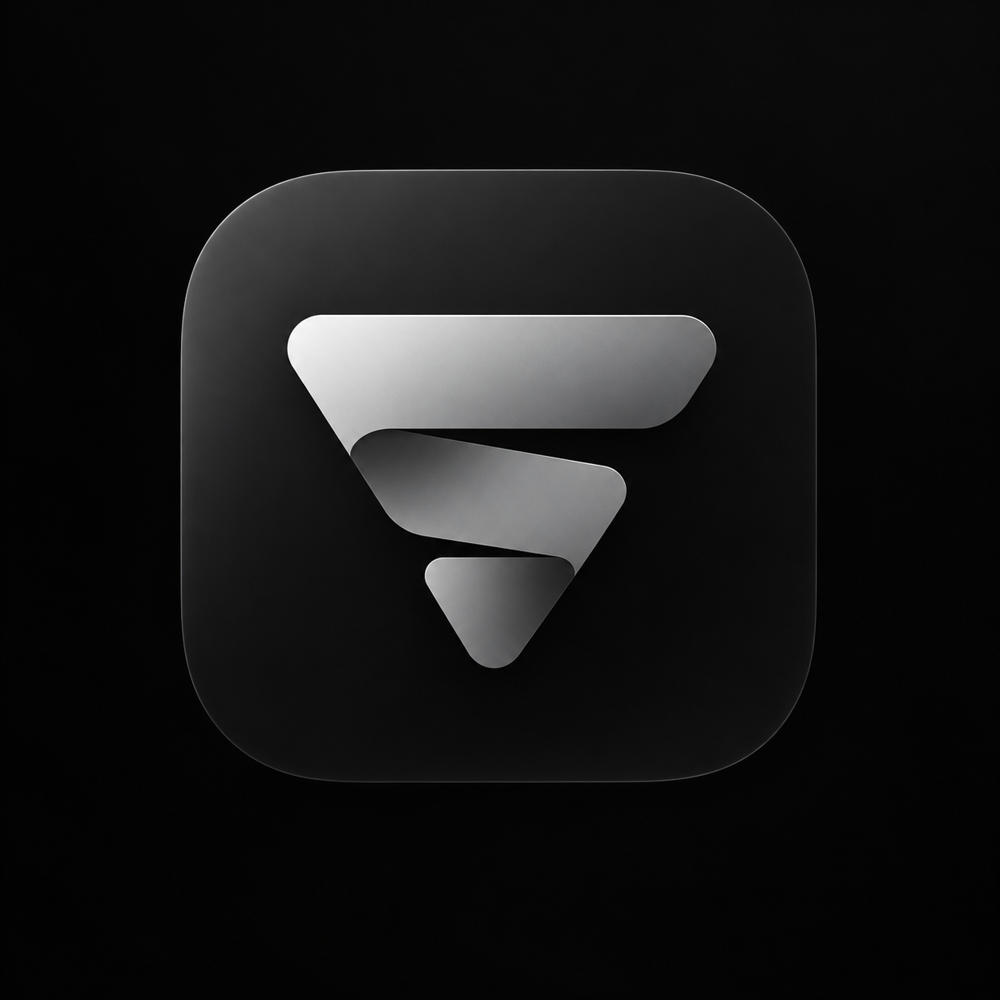

<p align="center"></p>

# Lead Aggregator

Приложение для macOS, которое ищет компании в каталогах и собирает найденные карточки в общий список. Список можно сохранить в CSV, Excel или JSON.

> Неофициальный проект. Не связан с 2ГИС, Yell, Zoon или Rusprofile.

## Возможности

- Каталоги: 2ГИС, Yell, Zoon и Rusprofile.
- В карточке — адреса, телефоны, сайт, рейтинг, ИНН и другие сведения, если каталог их показывает.
- Повторные карточки объединяются при совпадении ИНН, ОГРН, телефона, сайта или названия вместе с адресом. Одного похожего названия недостаточно.
- Карточки с каждого сайта и общий список сохраняются на Mac.
- Список можно сохранить в CSV, Excel или JSON.

Телефоны и другие контакты могут быть скрыты самим каталогом; такие поля останутся пустыми.

## Установка приложения

Из корня проекта выполните:

```bash
./scripts/install-macos.sh
```

Скрипт проверит инструменты, соберёт приложение и установит его в `~/Applications/Lead Aggregator.app`.

## Запуск в разработке

Нужны macOS 13+, Xcode Command Line Tools, Rust 1.96+, Node.js 22+ и pnpm 11+.

```bash
make setup
make dev
```

Чтобы собрать приложение и `.dmg`, запустите:

```bash
pnpm build
```

Также можно вручную запустить GitHub Actions → **Build macOS** → **Run workflow** и скачать собранные `.app` и `.dmg` из artifacts.

## Как проходит поиск

Укажите, кого искать, и выберите сайты. Программа найдёт карточки компаний, сравнит их и соберёт общий список. Готовый файл появится в папке «Загрузки» на вашем компьютере.


## Из чего состоит программа


Для разработчиков: [как устроен код и как работает объединение карточек](ARCHITECTURE.md).

## Ограничения и безопасность

- Для поиска программа обращается к страницам каталогов; отдельный браузер не запускается.
- Если сайт ограничивает запросы или просит пройти проверку, программа останавливает поиск на нём. Остальные выбранные сайты продолжают работу. Программа не обходит эти ограничения.
- Сайты могут менять страницы или не показывать часть контактов.
- Перед массовым сбором проверьте условия использования источника и требования к обработке контактных данных в вашей юрисдикции.

## Команды разработки

| Команда | Действие |
| --- | --- |
| `make setup` | Установить зависимости |
| `make dev` | Запустить приложение в режиме разработки |
| `make fmt` | Форматировать Rust и Svelte |
| `make check` | Проверить Rust-код и Svelte-интерфейс |
| `make test` | Запустить тесты Rust workspace |
| `make build` | Собрать приложение |

## Архитектурные решения

Ключевые решения и ссылки на исходные проекты собраны в [ADR](docs/adr/) и [THIRD_PARTY_REFERENCES.md](THIRD_PARTY_REFERENCES.md). Код референсов не копировался в проект.

Проект распространяется по лицензии [MIT](LICENSE).
