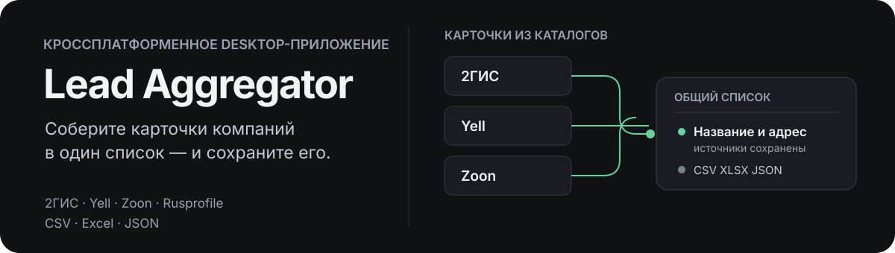
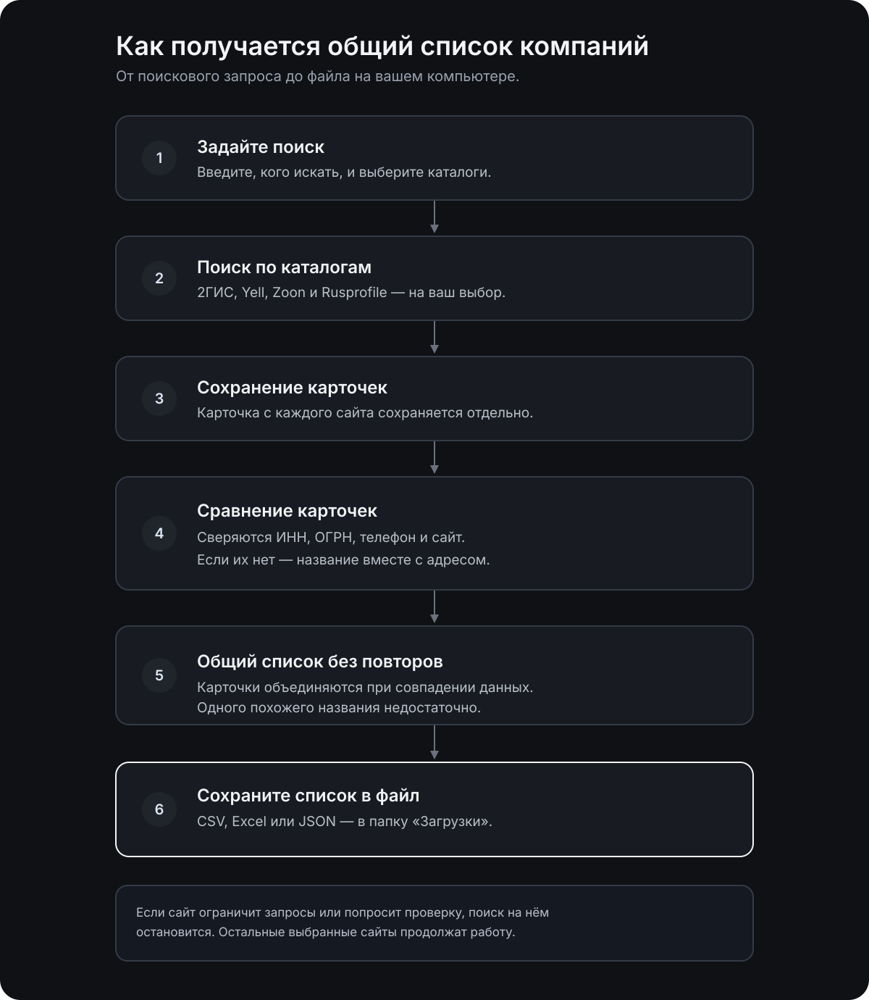
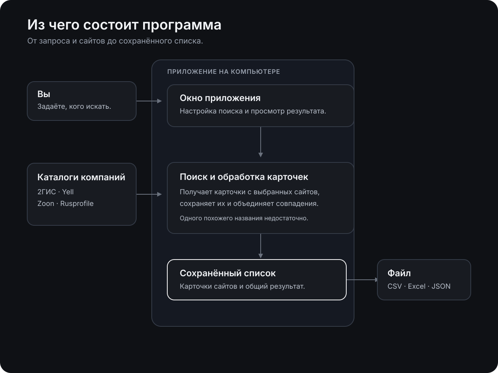

<p align="center">
  
</p>

<p align="center">
  <a href="https://1tuz.github.io/Lead-Aggregator/">Сайт проекта</a> ·
  <a href="https://github.com/1tuz/Lead-Aggregator">Исходный код</a> ·
  Desktop · MIT
</p>

# Lead Aggregator

Ищите компании в каталогах, объединяйте повторные карточки и сохраняйте общий список в CSV, Excel или JSON.

> Независимый проект. Не связан с 2ГИС, Yell, Zoon или Rusprofile.

## Установка

Установите последнюю сборку macOS на Apple Silicon или Linux на Debian/Ubuntu x86_64 одной командой:

```bash
curl -fsSL https://raw.githubusercontent.com/1tuz/Lead-Aggregator/main/scripts/install.sh | bash
```

Скрипт определит систему и архитектуру, скачает готовую сборку из [GitHub Releases](https://github.com/1tuz/Lead-Aggregator/releases), установит и запустит приложение. Если в последнем релизе нет сборки для вашей системы, он возьмёт последнюю доступную. На macOS приложение ставится в `/Applications/Lead Aggregator.app` (если каталог доступен для записи; иначе в `~/Applications`, либо задайте `LEAD_AGGREGATOR_INSTALL_DIR`). На Debian/Ubuntu установщик `.deb` попросит `sudo` для установки системного пакета.

Сборки macOS пока без Apple Developer ID и notarization. На macOS 15+ Gatekeeper часто показывает «повреждено» / «не удалось проверить» — это не битый DMG и не обязательно crash приложения. Тогда: правый клик по приложению → Open → Open, либо `xattr -dr com.apple.quarantine "/Applications/Lead Aggregator.app"` (или тот же путь в `~/Applications`). При необходимости: System Settings → Privacy & Security → Open Anyway.

На Windows скачайте `.msi` из [последнего GitHub Release](https://github.com/1tuz/Lead-Aggregator/releases) и запустите его.

### Удаление

macOS / Debian/Ubuntu — остановить процесс, снять приложение из `/Applications` и `~/Applications`, плюс локальные данные:

```bash
curl -fsSL https://raw.githubusercontent.com/1tuz/Lead-Aggregator/main/scripts/uninstall.sh | bash
```

Скрипт удаляет:

- `/Applications/Lead Aggregator.app` и `~/Applications/Lead Aggregator.app`
- `~/Library/Application Support/dev.local.lead-aggregator` (база и настройки)
- кэш / WebKit / Preferences / Saved State с тем же bundle id
- на Linux — пакет через `apt`, плюс пользовательские data/cache/config каталоги

Для ручной сборки macOS-версии нужны macOS 13+, Xcode Command Line Tools, Rust 1.96+, Node.js 22+ и pnpm 11+.

## Как это работает

Вы задаёте запрос и источники. Приложение собирает доступные карточки, сравнивает их по сильным ключам и сохраняет результат локально. Исходные карточки и список можно экспортировать в CSV, Excel или JSON.



Совпадения объединяются по ИНН, ОГРН, телефону, домену сайта или нормализованным названию и адресу. Одного похожего названия недостаточно: такие записи получают отметку «Возможный дубль», чтобы не потерять филиалы.

Для больших сборов можно выбрать отдельный город, весь регион или все доступные города России. У каждого источника свои настройки лимита, страниц, паузы и параллельности, а встроенные безопасные минимумы нельзя обойти пользовательскими настройками.

Длинный сбор сохраняет контрольные точки `источник × регион`. Если приложение закрыть или сбор отменить, его можно продолжить позже: уже завершённые цели не запрашиваются повторно. Таблица результатов загружается страницами, поэтому интерфейс не пытается одновременно отрисовать десятки тысяч строк.

При HTTP 429 приложение учитывает `Retry-After` (если он задан числом секунд) или использует ограниченный backoff. HTTP 403, CAPTCHA и anti-bot проверки не обходятся: проблемный источник получает отдельный статус и останавливается, а остальные продолжают работу.

## Источники и данные

Поддерживаются 2ГИС, Yell, Zoon и Rusprofile. Доступность отдельных полей зависит от каталога: если телефон или сайт скрыт источником, соответствующее поле останется пустым.

Исходные записи каждого каталога хранятся отдельно. Объединённая карточка сохраняет сведения об источниках и найденных филиалах, поэтому алгоритм дедупликации можно улучшать без повторного сбора.



## Ограничения и безопасность

- 403, CAPTCHA и anti-bot проверки не обходятся. 429 обрабатывается только ожиданием `Retry-After`/backoff в пределах заданных настроек.
- Пауза источника останавливает выдачу новых запросов, но не прерывает уже отправленный HTTP-запрос.
- Каталоги могут менять страницы и скрывать контакты.
- Перед массовым сбором проверьте условия использования источников и требования к обработке контактных данных в вашей юрисдикции.
- Приложение не запускает отдельный браузер. Внешние запросы выполняют Rust-провайдеры; интерфейс общается с ними через Tauri IPC.

## Разработка

```bash
make setup
make dev
```

| Команда      | Действие                       |
| ------------ | ------------------------------ |
| `make fmt`   | Форматировать Rust и Svelte    |
| `make check` | Проверить Rust-код и интерфейс |
| `make test`  | Запустить тесты Rust workspace |
| `make build` | Собрать приложение             |

Подробнее об архитектуре, дедупликации и решениях проекта — в [ARCHITECTURE.md](ARCHITECTURE.md) и [ADR](docs/adr/).

Проект распространяется по лицензии [MIT](LICENSE).
